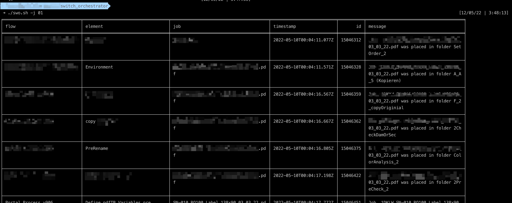

# switch-lazy-cli

## About

switch-lazy-cli is a command-line tool designed to simplify the process of searching work logs on Enfocus Switch. If you spend a significant amount of time coding and frequently switch between GUI and Terminal, you understand the inconvenience of navigating to Switch to check logs.



### Requirements

switch-lazy-cli relies on a few basic tools commonly found on Linux/Unix systems. 
Ensure you have a text editor (like Vim or Emacs), a program to print files (such as cat), and essential utilities like mkdir, touch, mv, rm, echo, and printf. 
Additionally, two libraries, JQ and JTBL, are needed for optimal development.

JQ [Github Repository](https://github.com/stedolan/jq)

JTBL [Github Repository](https://kellyjonbrazil.github.io/jtbl)

And most important, Enfocus Switch with support to API. (from 2018)


### Before Start

#### Install

Clone this repository

1. Make the script executable:
Starting from the folder that swo.sh is located
```bash
chmod +x swo.sh
```
2. Copy the script to /usr/local/bin for system-wide access:
```bash
sudo cp swo.sh /usr/local/bin/swo
```

#### Configuration
1. Create a file `swo_config` on `$HOME/.config/switchOrchestrator` or run `swo -c`

2. Please read the oficial manual of [Enfocus Switch API](https://www.enfocus.com/manuals/DeveloperGuide/WebServices/17/index.html#api-Authentication-LoginQuery) to learn how create a password hash or check bellow.

```bash
USER="joe"
HASH_PASS="XXXXXXXXXXXXXXXX"
SWITCH_IP="0.0.0.0"
```

#### Password Hash

Create a `enfocuspublic_key.pem` file and copy the PUBLIC KEY offered by [Enfocus Switch - Auth](https://www.enfocus.com/manuals/DeveloperGuide/WebServices/17/index.html#api-Authentication-LoginQuery)

```echo -n "REPLACEYOURPASSEHRE" | openssl rsautl -encrypt -pubin -inkey ./enfocuspublic_key.pem | base64```

If you dont know what you are doing search [Check it](https://letmegooglethat.com/?q=Encript+rsa+pass+online) -> do it on your own  risk

> Note: If you are unfamiliar with RSA encryption, consider searching for more information before proceeding. Perform encryption operations at your own risk.

This command encrypts your password using the Enfocus Switch public key and base64 encodes the result. Exercise caution and ensure a secure environment when dealing with sensitive information

### Usage

#### Auth

```bash
swo -a
```
This command initiates the authentication process and saves the resulting token. The generated token is crucial for making subsequent API calls. Execute this command to securely obtain the required authentication token for interacting with the Enfocus Switch API.

#### Search for Job

```bash
swo -j JOBNUMBER
```
This command retrieves the type, flow name, job, element, message, and timestamp associated with the specified job number or string. It allows you to quickly and efficiently retrieve detailed information about a specific job in the switch-lazy-cli logs.

```bash
^ type   ^ flow                  ^ job                  ^ element                       ^ message                                                                  ^ timestamp                ^
| info   | test-flow live        |                      | New Job                       | Added unique name prefix, new name is '_J79O5_test-job swo.xml'          | 2024-02-17T00:06:22.617Z |
| info   | test-flow live        | test-job swo.xml     | XML action                    | Metadata was attached to asset '/Users/_J79O5_test-job swo.xml'          | 2024-02-17T00:06:22.744Z |
| info   | test-flow live        | test-job swo.xml     | XML action                    | File _J79O5_test-job swo.xml was renamed to file _J79O5_test-job swo.xml | 2024-02-17T00:06:22.750Z |
```

#### Search for Job

```bash
swo -f
```
This command retrieves and displays information about the status, name, and groups of existing flows. The output is formatted for easy comprehension, highlighting the status of each flow in color-coded text. Use this command to quickly assess the current status of flows within your Enfocus Switch environment.

```bash
^ status   ^ name       ^ groups   ^
| running  | Example A  | INPUT    |
| stopped  | Example B  | ACTION   |
| running  | Example C  | ACTION   |
| stopped  | Example D  | MACHINE  |
```

> Note: The status of each flow is color-coded for better visibility: <br>
>
>Running flows are highlighted in green. <br>
>Stopped flows are highlighted in red.


### Options

| Options                      | Description           |
| ---------------------------- | --------------------- |
| `-a --auth`                  | authentication        |
| `-j <string> --job <string>` | search a job          |
| `-h --help`                  | display help dialog   |
| `-i --install`               | create config folders |
| `-f --flows`                 | list flows and status |

### How do I contribute to switch-lazy-cli?

I'm far from expert and suspect there are many ways to improve. If you have ideas on how to make this project better, don't hesitate to fork and send pull requests!

### Authors

```Bruno Bertolani``` [LinkedIn](https://www.linkedin.com/in/brunosbertolani/)

### Research used on this project

<https://stackoverflow.com/questions/39139107/how-to-format-a-json-string-as-a-table-using-jq>
<https://www.makeareadme.com/>
<https://www.enfocus.com/manuals/DeveloperGuide/WebServices/17/index.html#api-Authentication-LoginQuery>
<https://makefiletutorial.com/#commands-and-execution>

### Next Features

- [X] Authentication
- [X] Search by Jobs
- [ ] Search with different parameters
- [ ] Refresh Search
- [X] List Workflow
- [ ] Start/Stop workflow
- [ ] Multiple Switch
- [ ] Environment ?
- [ ] Sync multiple scripts between enviroments
- [ ] Migrate to python ?
